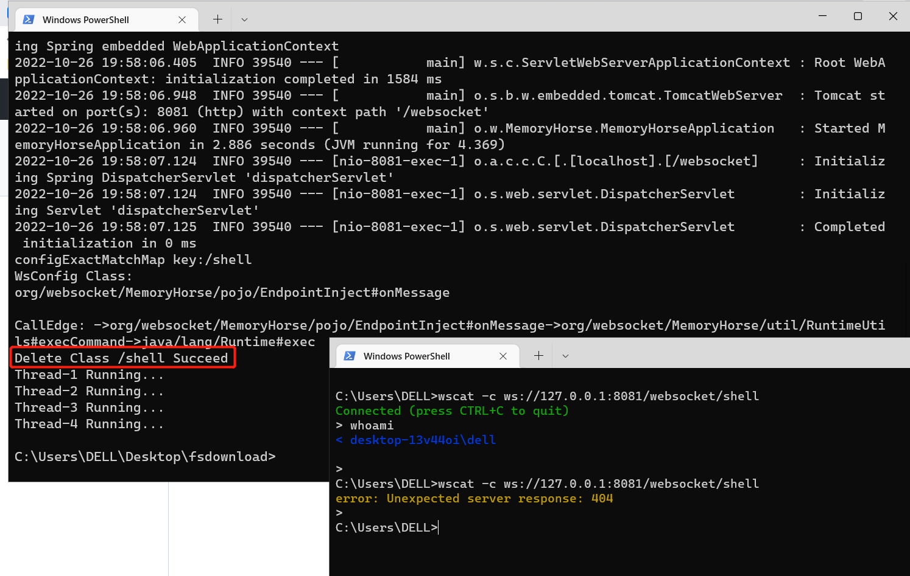

# MemoryShellHunter
Java Agent memory horse scanner combined with Call Graph modus


### How to used

```bash
java -javaagent:./MemoryShellHunter.jar -jar SpringBootRunner.jar
```


### Supported middleware

1.0 Version:

- Add WebSocket Memory Shell Check Algorithm


### Show results



