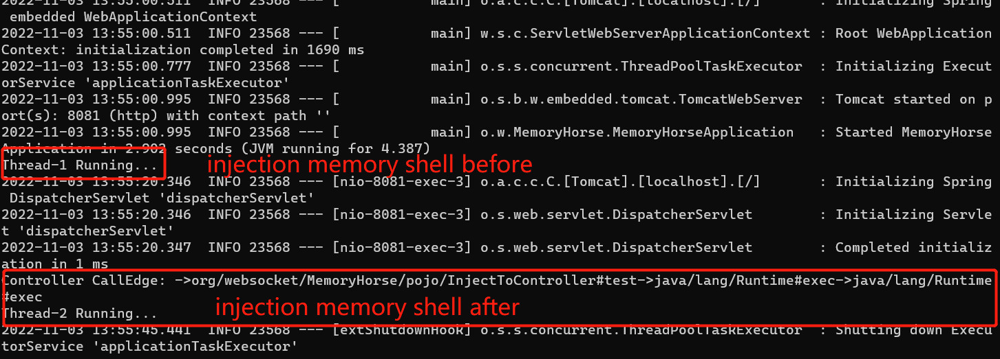
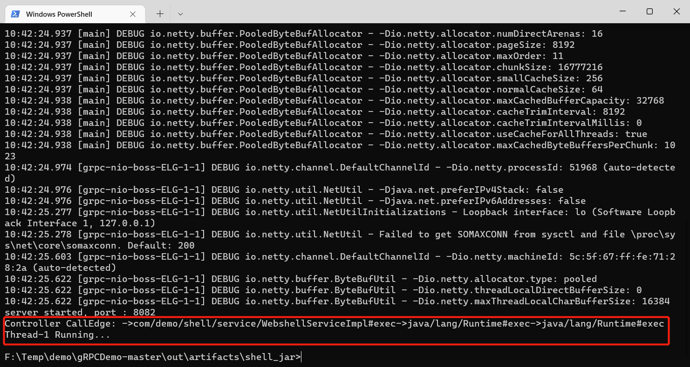

# MemoryShellHunter
Java Agent memory horse scanner combined with Call Graph modus


### About

MemoryShellHunter是一款结合动态Building Call Graph的内存马Scanner/Killer工具。支持Agent和Attach方式启动检测，弥补常规内存马检测工具需要人工验证WebSocket内存马的问题。

MemoryShellHunter项目使用了逆拓扑算法精确捕获恶意方法的调用行为，可弥补SpringBoot内存马查杀的难点和WebSocket新型内存马无法从Class文件是否落地上进行判断。有着性能影响低于一般的RASP检测、属于轻量级Agent、对业务代码侵入性小等特点。


### How to used

```bash
java -javaagent:./MemoryShellHunter.jar -jar SpringBootRunner.jar
```

```java
VirtualMachine vmObj = VirtualMachine.attach(targetJvmPid);//targetJvmPid为目标JVM的进程ID  
vmObj.loadAgent(agentJarPath, cfg);  // agentJarPath为MemoryShellHunter jar包的路径，cfg为传递给agent的参数  
```


### Supported middleware

1.2 Version:

- Add gRPC memory shell check algorithm

1.1 Version:

- Add Controller memory shell check algorithm

1.0 Version:

- Add WebSocket memory shell check/delete algorithm


### Show results

##### WebSocket Memory Shell Test Report


##### Controller Memory Shell Test Report



##### gRPC Memory Shell Test Report

